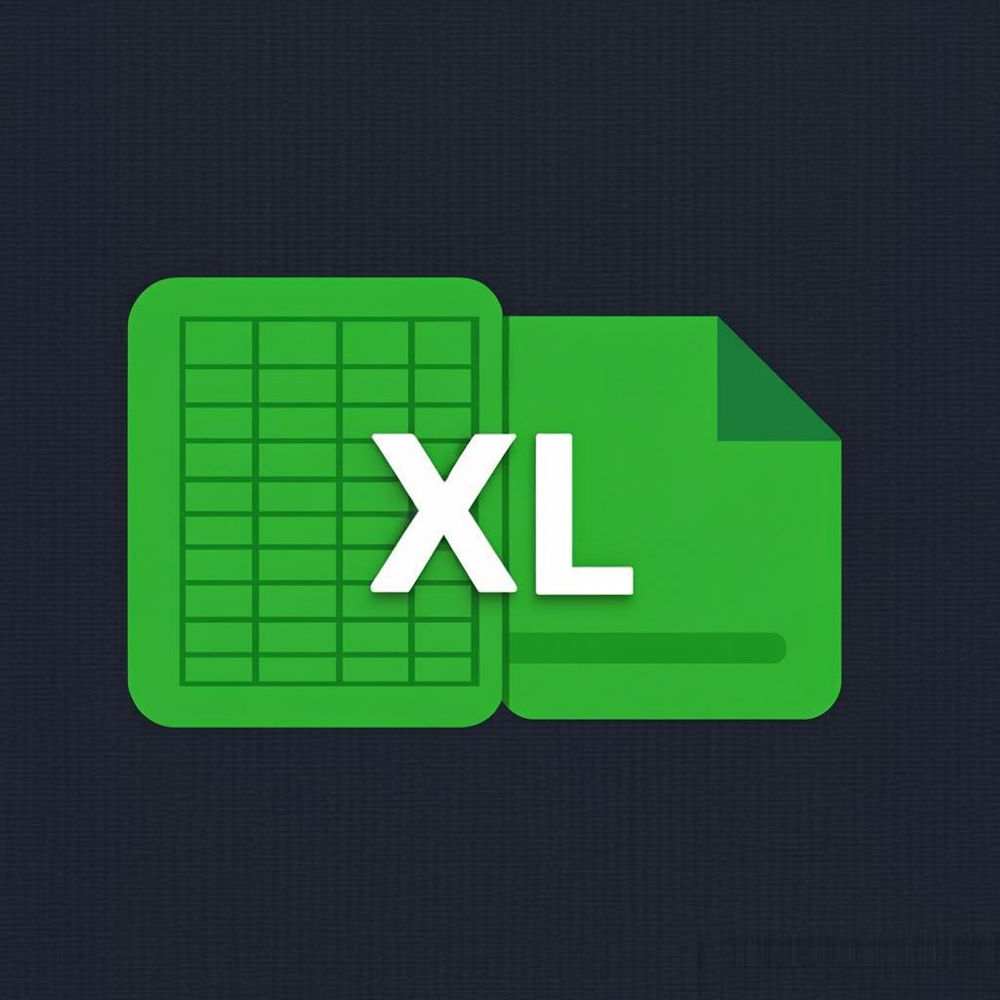

<div align="center">



# MINI-XL v2.0

**Lightweight CLI — Tabular Files → Professional Excel**

[](https://www.python.org/)
[](https://termux.dev/)
[](LICENSE)
[](test_mini_xl.py)

*Convert CSV, TSV, JSON and structured TXT into formatted `.xlsx` files — instantly.*

[Getting Started](#getting-started) • [Installation](INSTALL.md) • [Usage](#usage) • [Architecture](#architecture) • [Makefile](#makefile-commands)

</div>

---

## Overview

MINI-XL is a zero-bloat, terminal-first utility designed for **Termux on Android** and **standard Linux** environments. It scans your downloads folder, detects compatible tabular files, and converts them into professionally formatted Excel spreadsheets — all from a single command.

### Why MINI-XL?

| Problem | Solution |
|---------|----------|
| Opening CSV on mobile is painful | One command → formatted `.xlsx` |
| No Excel app on Termux | Works entirely in the terminal |
| Messy, unformatted spreadsheets | Auto-styled headers, filters, frozen rows |
| Multiple file formats | Auto-detects CSV, TSV, JSON, TXT |

---

## Features

- **Auto-detection** — Scans `~/storage/downloads` for compatible files
- **4 formats** — CSV (comma/semicolon), TSV, JSON (array of objects), structured TXT
- **Smart separator** — Automatically detects `,`, `;`, or `\t` delimiters
- **Header heuristic** — Detects whether the first row is a header and asks for confirmation
- **Professional Excel output**:
  - Bold headers on colored background
  - Frozen first row
  - Auto-adjusted column widths
  - Auto-filter enabled
  - Automatic numeric type conversion (int/float)
- **Timestamped filenames** — `rapport_ventes_20260608_154530.xlsx`
- **Lightweight** — Single dependency (`openpyxl`), under 850 total lines of code
- **Error handling** — Empty files, invalid JSON, permission errors, oversized files
- **Logging** — Full operation log at `~/storage/downloads/mini-xl.log`

---

## Getting Started

### Prerequisites

- Python 3.10 or higher
- pip (Python package manager)
- Termux (Android) or any Linux terminal

### Quick Install

```bash
# Clone the repository
git clone https://github.com/HackerCompagnion7/mini-xl.git
cd mini-xl

# Install dependencies
make setup
# — or manually:
pip install openpyxl
```

> **Full installation guide with Termux setup**: See [INSTALL.md](INSTALL.md)

### Run

```bash
make run
# — or:
python3 main.py
```

---

## Usage

### Interactive Mode (Default)

Simply run `mini-xl` and follow the prompts:

```
==================================================
  MINI-XL v2.0 — Tabular → Excel Converter
==================================================

  5 compatible file(s) found:

  [1]  rapport_ventes.csv (0.00 MB)
  [2]  stock_pointvirgule.csv (0.00 MB)
  [3]  donnees.tsv (0.00 MB)
  [4]  personnes.json (0.00 MB)
  [5]  inventaire.txt (0.00 MB)

  [0]  Quit

  Your choice : 1

  ✔ Conversion successful!
  📄 File: /data/storage/downloads/rapport_ventes_20260609_154530.xlsx
```

### Workflow

```
┌──────────────────┐     ┌──────────────┐     ┌───────────────┐
│  Scan Directory  │────▶│  Show Menu   │────▶│  User Selects │
│  ~/storage/...   │     │  Numbered    │     │  One File     │
└──────────────────┘     └──────────────┘     └───────┬───────┘
                                                      │
┌──────────────────┐     ┌──────────────┐     ┌───────▼───────┐
│  Save .xlsx      │◀────│  Generate    │◀────│  Analyze      │
│  + Timestamp     │     │  Excel File  │     │  Structure    │
└──────────────────┘     └──────────────┘     └───────────────┘
```

### Supported Formats

#### CSV (Comma-separated)
```csv
nom,age,ville
Jean,25,Paris
Paul,30,Lyon
```

#### CSV (Semicolon-separated)
```csv
produit;prix;quantité
Stylo;2.50;100
Cahier;4.80;50
```

#### TSV (Tab-separated)
```tsv
nom     age     ville   score
Alice   27      London  95
Bob     34      Berlin  87
```

#### JSON (Array of objects only)
```json
[
  {"nom": "Jean", "age": 20, "ville": "Paris"},
  {"nom": "Paul", "age": 30, "ville": "Lyon"}
]
```

> **Invalid JSON** (not an array of objects):
> ```json
> {"config": {"theme": "dark"}}
> ```

#### TXT (Structured tabular)
Must have at least 2 lines with a consistent, detectable separator (`,`, `;`, or `\t`).

---

## Architecture

```
mini-xl/
├── main.py          # CLI entry point — orchestrates the pipeline
├── scanner.py       # Directory scanning — detects compatible files
├── menu.py          # Interactive menu — user selection & confirmation
├── analyseur.py     # File analysis — parsing, separator & header detection
├── generateur.py    # Excel generation — formatting, styling, output
├── utils.py         # Shared utilities — timestamps, validation, logging
├── Makefile         # Build automation — install, test, lint, clean
├── test_mini_xl.py  # Test suite — 34 automated tests
└── logo.png         # Project logo
```

### Module Responsibilities

| Module | Input | Output |
|--------|-------|--------|
| `scanner.py` | Directory path | List of compatible files |
| `menu.py` | File list | User-selected file |
| `analyseur.py` | File path | Headers + Data + Detected type |
| `generateur.py` | Headers + Data | Formatted `.xlsx` file |
| `utils.py` | — | Shared helpers (timestamps, validation, logging) |
| `main.py` | — | Pipeline orchestration |

### Design Constraints

| Constraint | Limit |
|-----------|-------|
| Module size | ≤ 200 lines |
| Function size | ≤ 50 lines |
| Dependencies | `openpyxl` only (+ stdlib) |
| Python version | 3.10+ |
| File size limit | 100 MB (with warning) |

---

## Makefile Commands

```bash
make help       # Show all available commands
make setup      # Full setup (install deps + verify compilation)
make install    # Install openpyxl dependency
make run        # Launch MINI-XL
make test       # Run the test suite (34 tests)
make compile    # Verify all modules compile
make lint       # Static analysis with pyflakes
make check      # Full verification (compile + lint + test)
make clean      # Remove cache and temporary files
make info       # Display project info and versions
```

---

## Excel Output Format

Every generated `.xlsx` file includes:

| Feature | Details |
|---------|---------|
| **Header row** | Bold white text on blue (#4472C4) background, centered |
| **Data rows** | Clean font, left-aligned, auto-typed (int/float/str) |
| **Frozen panes** | First row frozen for scrolling |
| **Auto-filter** | Enabled on header row |
| **Column widths** | Auto-adjusted to content (max 50 chars) |
| **Sheet name** | Derived from source filename |
| **Numeric types** | Automatically converted — `25` → integer, `29.99` → float |

### Filename Convention

```
Source:  rapport ventes.csv
Output:  rapport_ventes_20260608_154530.xlsx
              ↑ cleaned      ↑ timestamp
```

- Spaces → underscores
- Special characters removed
- Timestamp format: `YYYYMMDD_HHMMSS`

---

## Error Handling

| Situation | Message |
|-----------|---------|
| Empty directory | `No compatible files found` |
| Empty file | `File empty` |
| Invalid JSON | `Invalid JSON format` |
| Non-tabular JSON | `JSON invalid: array of objects expected` |
| Permission denied | `Permission denied` |
| File > 100 MB | `Warning: file of X.X MB (recommended limit: 100 MB)` |
| Unexpected error | Logged to `mini-xl.log` + user message |

---

## Logging

All operations are logged to `~/storage/downloads/mini-xl.log`:

```
2026-06-08 15:45:30 | INFO | File: rapport_ventes.csv | Result: success
2026-06-08 15:46:12 | ERROR | File: bad.json | Result: failure | Error: Invalid JSON format
```

---

## Performance

| Rows | Target Time |
|------|------------|
| 10,000 | < 2 seconds |
| 100,000 | < 10 seconds |

Recommended maximum file size: **100 MB**

---

## License

This project is licensed under the MIT License — see the [LICENSE](LICENSE) file for details.

---

<div align="center">

**MINI-XL v2.0** — Built for Termux. Works everywhere.

</div>
